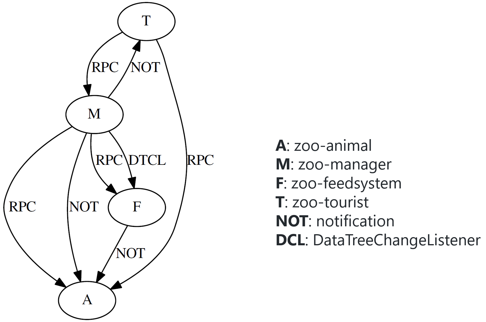

# OpenDayLight Zoo

## Introduction 
A toy program that consists of four bundles. The dependencies of these bundles is illustrated as the following graph:

A: zoo-animal
M: zoo-manager
F: zoo-feedsystem
T: zoo-tourist
NOT: notification
DCL: DataTreeChangeListener

## How to run this app?
1. Conduct **_mvn clean install -DskipTests_** in this folder
2. Run **_./karaf_** in _./distribution/karaf/target/assembly/bin/_ to launch an ODL instance with _zoo_
3. Execute **_bundle:list | grep zoo_** in karaf shell to check if related bundles are activated
4. Send HTTP requests via postman/odl-dluxapps

### Bug scripts:
1. ./Bug1- add tourists.postman_collection.json
2. ./Bug2- check eating rate.postman_collection.json

Import them into postman, and then use them to trigger these two injected bug.