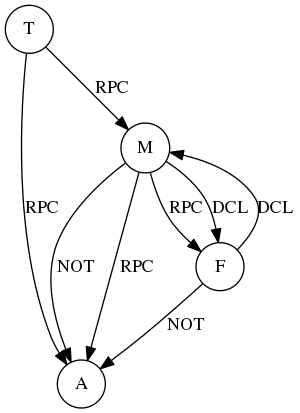

# OpenDayLight Zoo

A toy program that consists of four bundles. The dependencies of these bundles is illustrated as the following graph:

A: zoo-animal
M: zoo-manager
F: zoo-feedsystem
T: zoo-tourist
NOT: notification
DCL: DataTreeChangeListener
